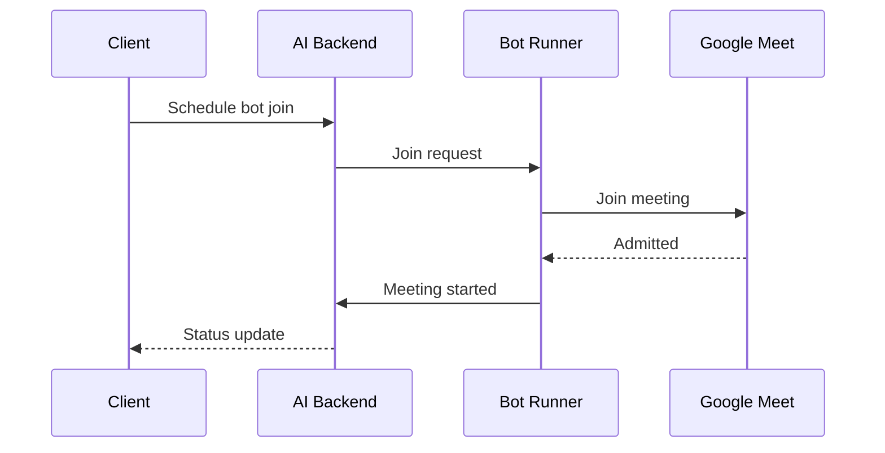
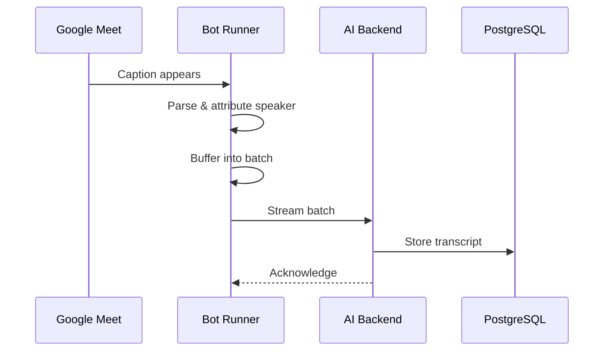
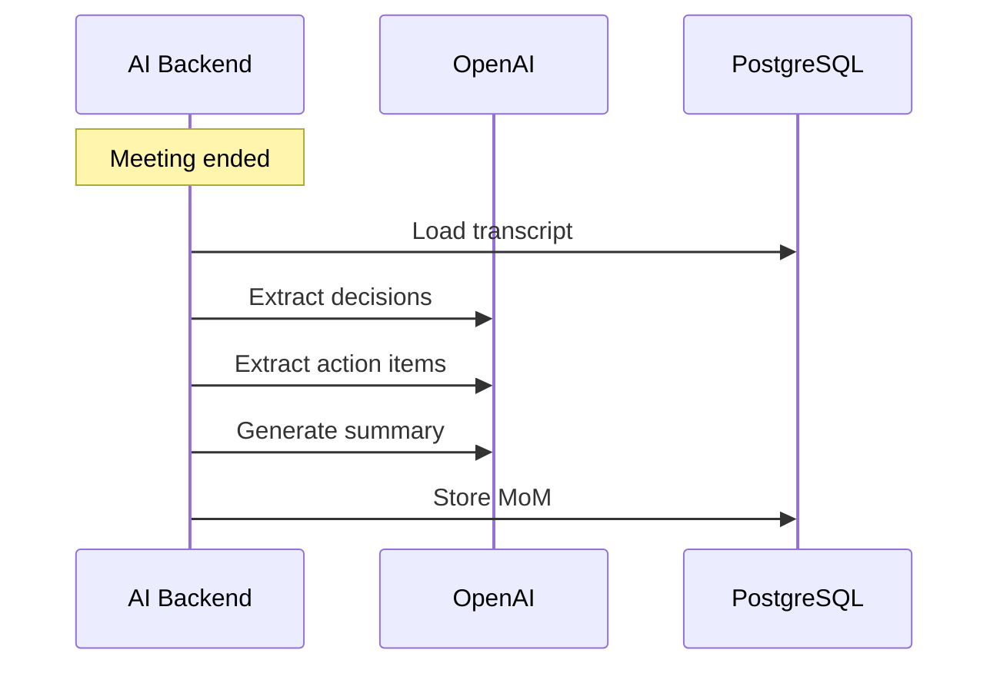

# System Architecture

## Overview

The Meeting AI system consists of two main services that communicate via REST/WebSocket APIs.

```
┌──────────────────────────────────────────────────────────────────┐
│                        Meeting AI System                         │
├──────────────────────────────────────────────────────────────────┤
│                                                                  │
│  ┌─────────────┐       ┌──────────────────┐                      │
│  │ Google Meet │       │  Web Dashboard   │                      │
│  │   Session   │       │ (Next.js/React)  │                      │
│  └──────┬──────┘       └────────┬─────────┘                      │
│         │ Join                  │ REST/Auth                      │
│         ▼                       ▼                                │
│  ┌─────────────┐       ┌──────────────────┐                      │
│  │ Bot Runner  │──────▶│    AI Backend    │                      │
│  └─────────────┘       └────────┬─────────┘                      │
│                                 │                                │
│                        ┌────────▼─────────┐                      │
│                        │    PostgreSQL    │                      │
│                        └──────────────────┘                      │
└──────────────────────────────────────────────────────────────────┘
```

## Data Flow

### 1. Meeting Join Flow



### 2. Transcript Streaming Flow



### 3. MoM Generation Flow



## Package Dependencies

```
@meeting-ai/shared
        ▲
        │ (workspace:*)
   ┌────┼────┐
   │    │    │
   ▼    ▼    ▼
 bot   ai   web
runner backend

```

## Technology Stack

| Component  | Technology             |
| ---------- | ---------------------- |
| Web App    | Next.js 14, React      |
| Bot Runner | Playwright, TypeScript |
| AI Backend | Fastify, TypeScript    |
| AI/LLM     | OpenAI GPT-4           |
| Database   | PostgreSQL             |
| Auth       | JWT, bcrypt            |
| Testing    | Vitest                 |
