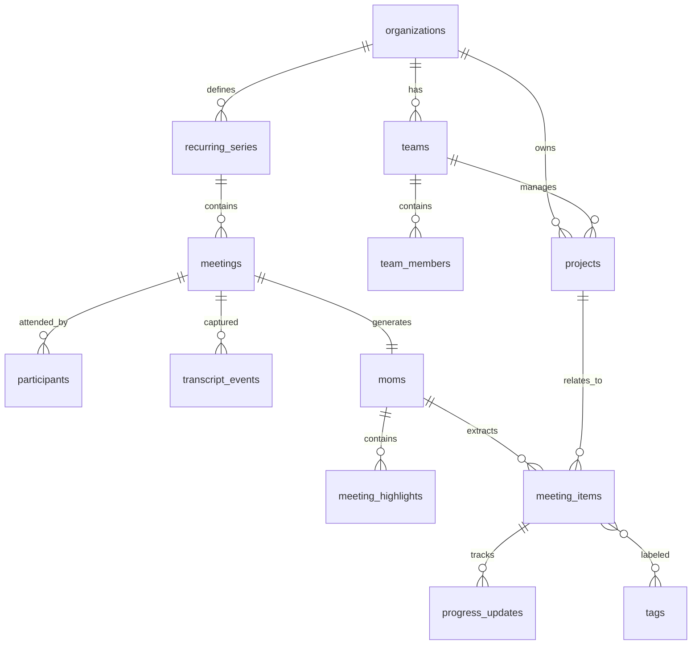

# Database Schema Reference

> Complete reference for all database tables and relationships.

## Entity Relationship Diagram



---

## Tables Reference

### Core Organization Tables

#### `organizations`

Top-level entity representing a company or workspace.

| Column       | Type      | Nullable | Description                  |
| ------------ | --------- | -------- | ---------------------------- |
| `id`         | UUID      | No       | Primary key                  |
| `name`       | TEXT      | No       | Organization name            |
| `slug`       | TEXT      | No       | URL-safe identifier (unique) |
| `logo_url`   | TEXT      | Yes      | Logo image URL               |
| `is_active`  | BOOLEAN   | No       | Soft delete flag             |
| `created_at` | TIMESTAMP | No       | Creation time                |
| `updated_at` | TIMESTAMP | No       | Last update time             |

#### `teams`

Groups within an organization.

| Column            | Type      | Nullable | Description        |
| ----------------- | --------- | -------- | ------------------ |
| `id`              | UUID      | No       | Primary key        |
| `organization_id` | UUID      | No       | FK → organizations |
| `name`            | TEXT      | No       | Team name          |
| `description`     | TEXT      | Yes      | Team description   |
| `is_active`       | BOOLEAN   | No       | Soft delete flag   |
| `created_at`      | TIMESTAMP | No       | Creation time      |

#### `projects`

Projects that meetings can be associated with.

| Column            | Type      | Nullable | Description                       |
| ----------------- | --------- | -------- | --------------------------------- |
| `id`              | UUID      | No       | Primary key                       |
| `organization_id` | UUID      | No       | FK → organizations                |
| `team_id`         | UUID      | Yes      | FK → teams (optional)             |
| `name`            | TEXT      | No       | Project name                      |
| `description`     | TEXT      | Yes      | Project description               |
| `status`          | TEXT      | Yes      | 'active', 'completed', 'archived' |
| `start_date`      | TIMESTAMP | Yes      | Project start                     |
| `end_date`        | TIMESTAMP | Yes      | Project end                       |

---

### Meeting Tables

#### `meetings`

Core meeting entity.

| Column                | Type      | Nullable | Description              |
| --------------------- | --------- | -------- | ------------------------ |
| `id`                  | UUID      | No       | Primary key              |
| `organization_id`     | UUID      | Yes      | FK → organizations       |
| `project_id`          | UUID      | Yes      | FK → projects            |
| `recurring_series_id` | UUID      | Yes      | FK → recurring_series    |
| `google_meet_link`    | TEXT      | No       | Meet URL                 |
| `title`               | TEXT      | No       | Meeting title            |
| `description`         | TEXT      | Yes      | Meeting description      |
| `meeting_type`        | ENUM      | No       | See [Enums](#enums)      |
| `status`              | ENUM      | No       | Meeting lifecycle status |
| `start_time`          | TIMESTAMP | Yes      | Actual start time        |
| `end_time`            | TIMESTAMP | Yes      | Actual end time          |
| `duration_minutes`    | INTEGER   | Yes      | Calculated duration      |
| `bot_session_id`      | TEXT      | Yes      | Bot runner session       |

#### `participants`

Who attended each meeting.

| Column                      | Type      | Nullable | Description              |
| --------------------------- | --------- | -------- | ------------------------ |
| `id`                        | UUID      | No       | Primary key              |
| `meeting_id`                | UUID      | No       | FK → meetings            |
| `display_name`              | TEXT      | No       | Participant name         |
| `email`                     | TEXT      | Yes      | Email if known           |
| `speaker_id`                | TEXT      | Yes      | For caption attribution  |
| `is_bot`                    | BOOLEAN   | No       | Is this the meeting bot? |
| `joined_at`                 | TIMESTAMP | Yes      | Join time                |
| `left_at`                   | TIMESTAMP | Yes      | Leave time               |
| `speaking_duration_seconds` | INTEGER   | Yes      | Total speaking time      |

---

### Content Tables

#### `transcript_events`

Raw transcript data with speaker attribution.

| Column            | Type      | Nullable | Description               |
| ----------------- | --------- | -------- | ------------------------- |
| `id`              | UUID      | No       | Primary key               |
| `meeting_id`      | UUID      | No       | FK → meetings             |
| `speaker`         | TEXT      | No       | Speaker display name      |
| `speaker_id`      | TEXT      | Yes      | Unique speaker identifier |
| `content`         | TEXT      | No       | Transcript text           |
| `sequence_number` | INTEGER   | No       | Order in transcript       |
| `is_final`        | BOOLEAN   | No       | Final vs interim          |
| `confidence`      | REAL      | Yes      | Caption confidence        |
| `captured_at`     | TIMESTAMP | No       | When captured             |

#### `moms` (Minutes of Meeting)

AI-generated meeting summaries.

| Column               | Type      | Nullable | Description            |
| -------------------- | --------- | -------- | ---------------------- |
| `id`                 | UUID      | No       | Primary key            |
| `meeting_id`         | UUID      | No       | FK → meetings (unique) |
| `executive_summary`  | TEXT      | Yes      | One-paragraph summary  |
| `detailed_summary`   | TEXT      | Yes      | Full summary           |
| `attendance_summary` | JSONB     | Yes      | Attendance stats       |
| `ai_model_version`   | TEXT      | Yes      | Model used             |
| `overall_confidence` | REAL      | Yes      | AI confidence score    |
| `processing_time_ms` | INTEGER   | Yes      | Generation time        |
| `generated_at`       | TIMESTAMP | No       | When generated         |

#### `meeting_highlights`

Concise key points for quick search.

| Column           | Type    | Nullable | Description         |
| ---------------- | ------- | -------- | ------------------- |
| `id`             | UUID    | No       | Primary key         |
| `meeting_id`     | UUID    | No       | FK → meetings       |
| `mom_id`         | UUID    | Yes      | FK → moms           |
| `highlight_type` | ENUM    | No       | See [Enums](#enums) |
| `content`        | TEXT    | No       | The highlight text  |
| `importance`     | INTEGER | Yes      | 1-5 scale           |
| `keywords`       | TEXT[]  | Yes      | For text search     |

#### `meeting_items`

Unified table for all extracted content types.

| Column                    | Type  | Nullable | Description           |
| ------------------------- | ----- | -------- | --------------------- |
| `id`                      | UUID  | No       | Primary key           |
| `meeting_id`              | UUID  | No       | FK → meetings         |
| `mom_id`                  | UUID  | Yes      | FK → moms             |
| `project_id`              | UUID  | Yes      | FK → projects         |
| `item_type`               | ENUM  | No       | Type of item          |
| `title`                   | TEXT  | No       | Item title            |
| `description`             | TEXT  | Yes      | Details               |
| `assignee`                | TEXT  | Yes      | Assigned person       |
| `assignee_email`          | TEXT  | Yes      | Email if known        |
| `due_date`                | DATE  | Yes      | Due date              |
| `status`                  | ENUM  | Yes      | Item status           |
| `priority`                | ENUM  | Yes      | Priority level        |
| `metadata`                | JSONB | Yes      | Type-specific data    |
| `ai_confidence`           | REAL  | Yes      | Extraction confidence |
| `source_transcript_range` | JSONB | Yes      | Source reference      |

---

## Enums

### `meeting_status`

```
scheduled → bot_joining → in_progress → completed
                                      → cancelled
                                      → error
```

### `meeting_type`

- `standup`, `sprint_planning`, `sprint_review`, `retrospective`
- `one_on_one`, `all_hands`, `project_kickoff`, `brainstorm`
- `client_call`, `interview`, `training`, `other`

### `meeting_item_type`

- `action_item`, `decision`, `announcement`, `project_update`
- `blocker`, `idea`, `question`, `risk`, `commitment`
- `deadline`, `dependency`, `parking_lot`, `key_takeaway`, `reference`

### `priority`

- `low`, `medium`, `high`, `critical`

### `item_status`

- `pending`, `in_progress`, `completed`, `blocked`, `deferred`, `cancelled`

### `highlight_type`

- `executive_summary`, `key_point`, `notable_quote`, `outcome`

---

## JSONB Metadata Examples

### Action Item

```json
{
  "estimated_hours": 4,
  "context": "Discussed during Q3 planning"
}
```

### Decision

```json
{
  "rationale": "Cost savings and faster iteration",
  "alternatives_considered": ["Option A", "Option B"]
}
```

### Risk

```json
{
  "severity": "high",
  "probability": "medium",
  "mitigation": "Weekly check-ins with vendor"
}
```

### Reference

```json
{
  "url": "https://confluence.company.com/page/123",
  "document_type": "confluence"
}
```
