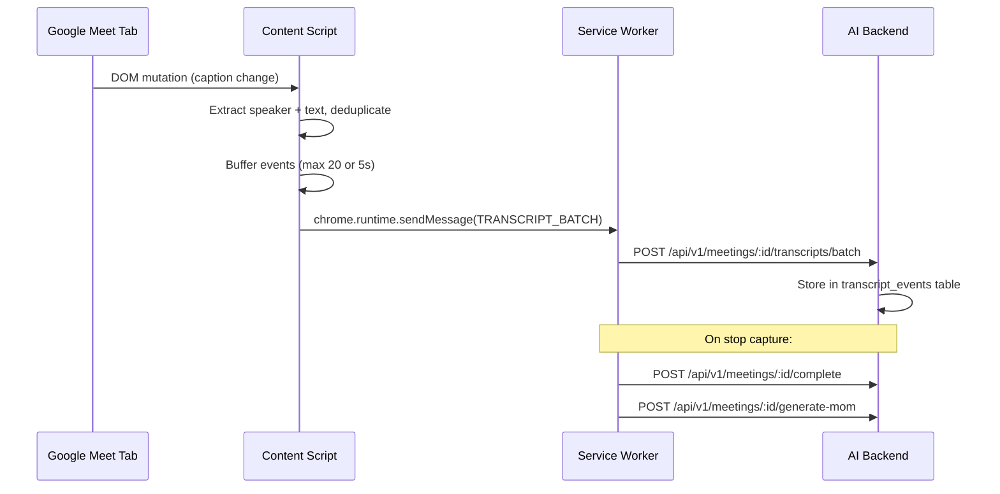

# Chrome Extension — Implementation Walkthrough

## What Was Built

A new `packages/chrome-extension` package — a Manifest V3 Chrome extension that captures Google Meet captions and streams them to the existing AI backend as a fallback to the bot-runner approach.

## Extension Structure

```
packages/chrome-extension/
├── manifest.json                          # Manifest V3 config
├── package.json                           # Package metadata
├── README.md                              # Usage + install guide
├── icons/                                 # 16/48/128px icons
├── src/
│   ├── content/caption-observer.js        # Caption DOM observer
│   ├── background/service-worker.js       # API client + meeting lifecycle
│   └── popup/
│       ├── popup.html                     # Popup structure
│       ├── popup.css                      # Dark theme styles
│       └── popup.js                       # UI logic
```

## Key Design Decisions

| Decision | Rationale |
|----------|-----------|
| **Reuses bot-runner DOM selectors** | Same `.iS70S`, `.McS7S`, `.VpS7S` selectors + fallbacks ensure caption extraction works identically |
| **Same backend API endpoints** | No new API needed — extension uses the exact same `POST /api/v1/meetings/:id/transcripts/batch` as bot-runner |
| **Vanilla JS (no build step)** | Chrome extensions load JS directly — avoids unnecessary bundling complexity |
| **`captureSource` field** | New DB column distinguishes bot vs extension vs manual transcript sources |

## Backend Changes

| File | Change |
|------|--------|
| [enums.ts](file:///Users/kumarsashank/dev/AI-Product-Manager/packages/ai-backend/src/db/schema/enums.ts) | Added `captureSourceEnum` |
| [meetings.ts schema](file:///Users/kumarsashank/dev/AI-Product-Manager/packages/ai-backend/src/db/schema/meetings.ts) | Added `captureSource` column |
| [meetings.ts routes](file:///Users/kumarsashank/dev/AI-Product-Manager/packages/ai-backend/src/routes/meetings.ts) | Accept `captureSource` in create meeting |
| [index.ts](file:///Users/kumarsashank/dev/AI-Product-Manager/packages/ai-backend/src/index.ts) | CORS now allows `chrome-extension://` origins |
| [meeting.ts shared](file:///Users/kumarsashank/dev/AI-Product-Manager/packages/shared/src/types/meeting.ts) | Added `CaptureSource` type |

## Popup UI Preview


## How to Test

1. Go to `chrome://extensions/` → Enable Developer Mode → Load unpacked → select `packages/chrome-extension`
2. Start the AI backend: `cd packages/ai-backend && PORT=3002 npx tsx src/index.ts`
3. Open a Google Meet meeting
4. Click the extension icon → Start Capture
5. Speak in the meeting with captions on → check the live event count
6. Stop Capture → verify MoM generation triggers

## Data Flow


